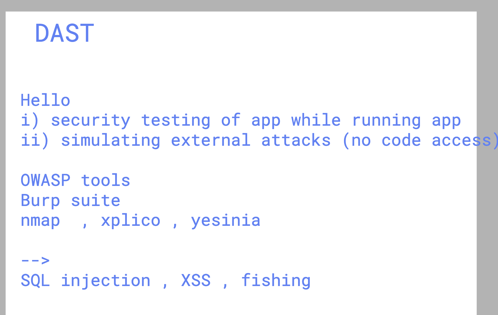

# unisys_devsecops28thjuly2025

### connecting dots with devops revision and understanding 


## Devops to Devsecops 


### Devsecops intro basic 


### making security changes in existing devops pipeline to get below things 


## devsecops  major things to be understood 


### DAST understanding 



## pipeline with devsecops options 


## Introduction to app server to deploy any webapp 


## some info about microsoft IIS server 


## enable and checking IIS status 

```
PS C:\Users\Administrator> Get-WindowsFeature  -Name  web-server                                                        
Display Name                                            Name                       Install State
------------                                            ----                       -------------
[X] Web Server (IIS)                                    Web-Server                     Installed


PS C:\Users\Administrator>


```

### verify default port number 

```
PS C:\Users\Administrator> NETSTAT.EXE  -ano    | findstr.exe  :80
  TCP    0.0.0.0:80             0.0.0.0:0              LISTENING       4
  TCP    0.0.0.0:8080           0.0.0.0:0              LISTENING       4
  TCP    172.31.44.127:62496    142.250.183.78:80      TIME_WAIT       0
  TCP    [::]:80                [::]:0                 LISTENING       4
  TCP    [::]:8080              [::]:0                 LISTENING       4
```

### some info about IIS webapp server with virtualhosting options 


## downside fo VM 


## container with multiple kernel support callled hypervisor Mode 


## Docker can be installed on window 2016 minimum server 


## option1 using default windows registry option to install docker server 

```
# Enable Windows containers feature
Enable-WindowsOptionalFeature -Online -FeatureName Containers -All

# Install Docker provider and package
Install-Module -Name DockerMsftProvider -Repository PSGallery -Force
Install-Package -Name docker -ProviderName DockerMsftProvider
```

# option2 -- manual download & install 

```
# 1. Enable required feature
Install-WindowsFeature Containers

# 2. Download and run the Docker CE (Moby) install script
Invoke-WebRequest -UseBasicParsing `
  "https://raw.githubusercontent.com/microsoft/Windows-Containers/Main/helpful_tools/Install-DockerCE/install-docker-ce.ps1" `
  -OutFile install-docker-ce.ps1

.\install-docker-ce.ps1

# 3. Restart the server if prompted
Restart-Computer

```

## verify installation 
```

PS C:\Users\Administrator> docker  version
Client:
 Version:           28.3.2
 API version:       1.51
 Go version:        go1.24.5
 Git commit:        578ccf6
 Built:             Wed Jul  9 16:12:31 2025
 OS/Arch:           windows/amd64
 Context:           default

Server: Docker Engine - Community
 Engine:
  Version:          28.3.2
  API version:      1.51 (minimum version 1.24)
  Go version:       go1.24.5
  Git commit:       e77ff99
  Built:            Wed Jul  9 15:41:13 2025
  OS/Arch:          windows/amd64
  Experimental:     false
PS C:\Users\Administrator>

```

## Images and containers 


### Docker host architecture 


## Docker basic operations 

### pulling images 

```
PS C:\Users\Administrator> docker  pull hello-world
Using default tag: latest
latest: Pulling from library/hello-world
Digest: sha256:ec153840d1e635ac434fab5e377081f17e0e15afab27beb3f726c3265039cfff
Status: Image is up to date for hello-world:latest
docker.io/library/hello-world:latest
PS C:\Users\Administrator>

```

### pulling base image of windows nano server

```
 docker pull mcr.microsoft.com/windows/nanoserver:ltsc2022
ltsc2022: Pulling from windows/nanoserver
Digest: sha256:9a57174ce85e979529e4f0cd58dff2e837b65fc7832b7585b4882f6cce0e255d
Status: Image is up to date for mcr.microsoft.com/windows/nanoserver:ltsc2022
mcr.microsoft.com/windows/nanoserver:ltsc2022
PS C:\Users\Administrator>
PS C:\Users\Administrator>

```

### image to pull 

```
 docker pull mcr.microsoft.com/windows/servercore:ltsc2022
ltsc2022: Pulling from windows/servercore
Digest: sha256:3281482945016cdaefbe417edd8338de8119e077b6941f74e78b050da1b7bd97
Status: Image is up to date for mcr.microsoft.com/windows/servercore:ltsc2022
mcr.microsoft.com/windows/servercore:ltsc2022

```