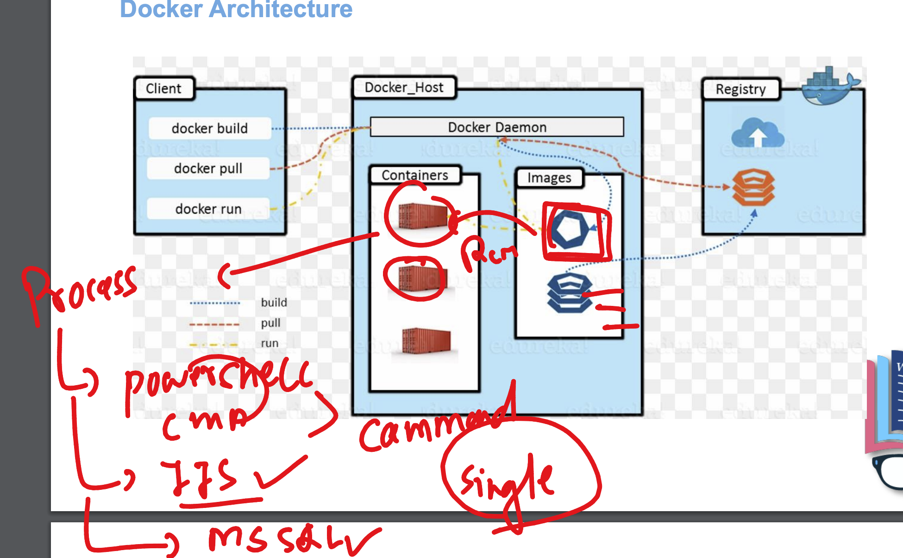
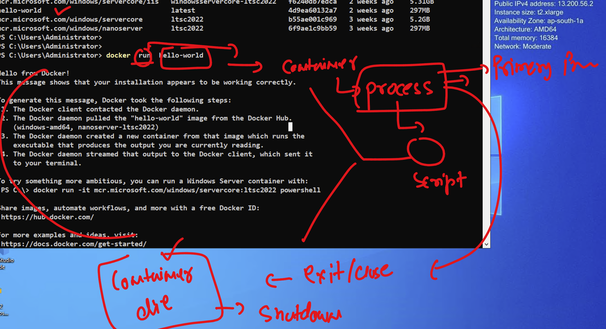
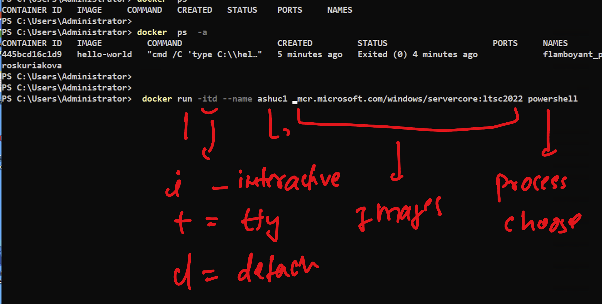

# unisys_devsecops28thjuly2025

### docker run to create a new container from image 



### creating first container 

```
PS C:\Users\Administrator> docker  run  hello-world

Hello from Docker!
This message shows that your installation appears to be working correctly.

To generate this message, Docker took the following steps:
 1. The Docker client contacted the Docker daemon.
 2. The Docker daemon pulled the "hello-world" image from the Docker Hub.
    (windows-amd64, nanoserver-ltsc2022)
 3. The Docker daemon created a new container from that image which runs the
    executable that produces the output you are currently reading.
 4. The Docker daemon streamed that output to the Docker client, which sent it
    to your terminal.

To try something more ambitious, you can run a Windows Server container with:
 PS C:\> docker run -it mcr.microsoft.com/windows/servercore:ltsc2022 powershell

Share images, automate workflows, and more with a free Docker ID:
 https://hub.docker.com/

```

### container life == life of process (primary process)



### list of all running containers 

```
S C:\Users\Administrator> docker  ps
CONTAINER ID   IMAGE     COMMAND   CREATED   STATUS    PORTS     NAMES
PS C:\Users\Administrator>


===> all the container running or non running 

C:\Users\Administrator>
PS C:\Users\Administrator> docker  ps  -a
CONTAINER ID   IMAGE         COMMAND                   CREATED         STATUS                     PORTS     NAMES
445bcd16c1d9   hello-world   "cmd /C 'type C:\\hel…"   5 minutes ago   Exited (0) 4 minutes ago             flamboyant_proskuriakova
PS C:\Users\Administrator>

```

### creating antoher container 


```
PS C:\Users\Administrator>
PS C:\Users\Administrator>  docker run -itd --name ashuc1  mcr.microsoft.com/windows/servercore:ltsc2022 powershell
6d348799fad8d04693f3c5b24a4fdb9c522d70b0d417c4c444651158f5436c85
PS C:\Users\Administrator>
PS C:\Users\Administrator>
PS C:\Users\Administrator> docker  ps  -a
CONTAINER ID   IMAGE                                           COMMAND                   CREATED         STATUS                     PORTS     NAMES
6d348799fad8   mcr.microsoft.com/windows/servercore:ltsc2022   "powershell"              6 seconds ago   Up 3 seconds                         ashuc1
445bcd16c1d9   hello-world                                     "cmd /C 'type C:\\hel…"   7 minutes ago   Exited (0) 7 minutes ago             flamboyant_proskuriakova
PS C:\Users\Administrator>
PS C:\Users\Administrator> docker  ps
CONTAINER ID   IMAGE                                           COMMAND        CREATED          STATUS          PORTS     NAMES
6d348799fad8   mcr.microsoft.com/windows/servercore:ltsc2022   "powershell"   18 seconds ago   Up 15 seconds             ashuc1
PS C:\Users\Administrator>

```

### understanding above 




