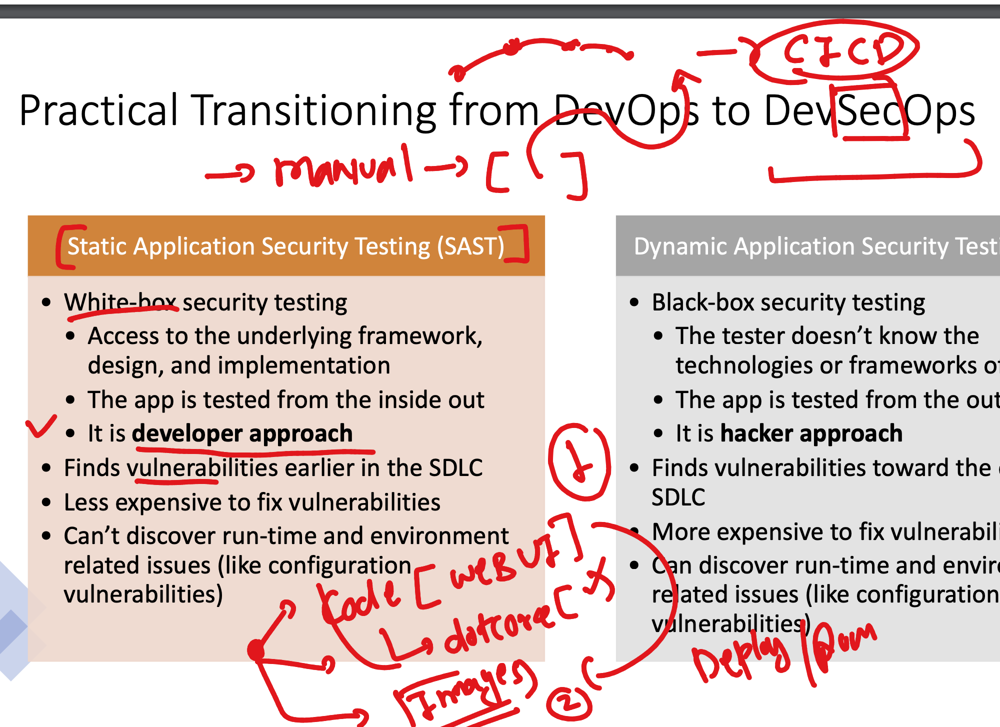
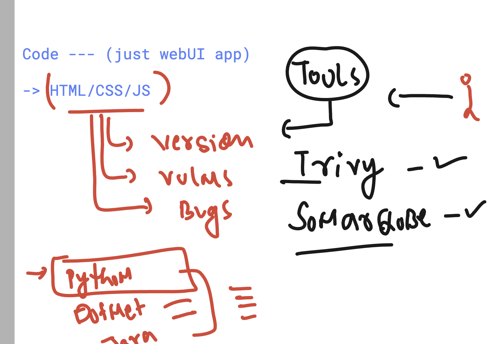
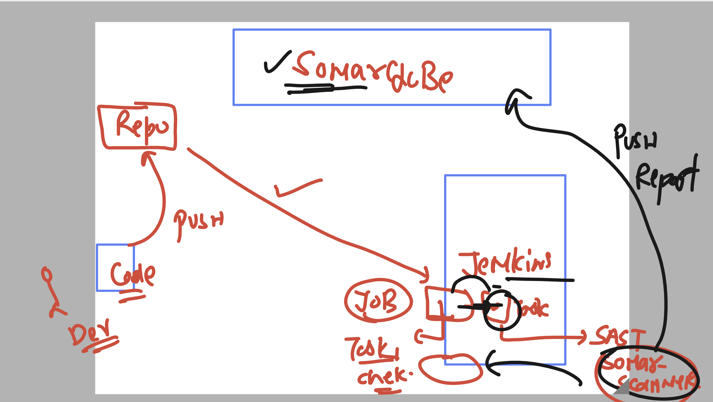
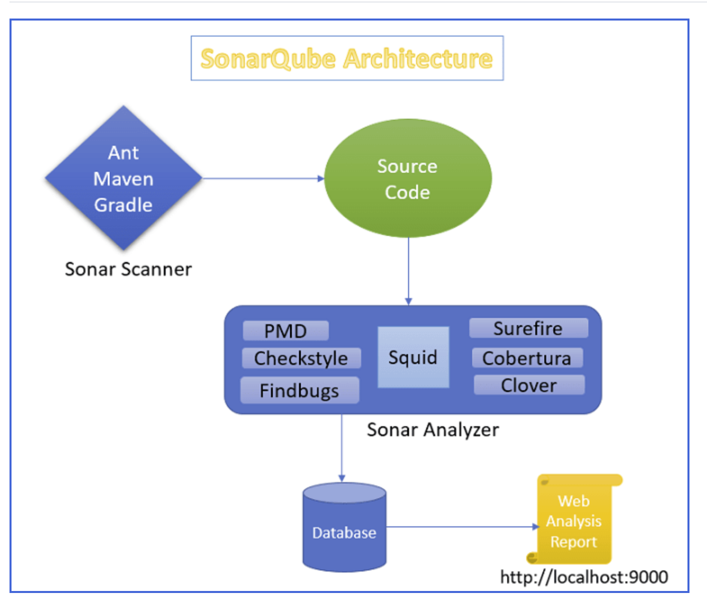

# unisys_devsecops28thjuly2025

### docker run to create a new container from image 


### creating first container 

```
PS C:\Users\Administrator> docker  run  hello-world

Hello from Docker!
This message shows that your installation appears to be working correctly.

To generate this message, Docker took the following steps:
 1. The Docker client contacted the Docker daemon.
 2. The Docker daemon pulled the "hello-world" image from the Docker Hub.
    (windows-amd64, nanoserver-ltsc2022)
 3. The Docker daemon created a new container from that image which runs the
    executable that produces the output you are currently reading.
 4. The Docker daemon streamed that output to the Docker client, which sent it
    to your terminal.

To try something more ambitious, you can run a Windows Server container with:
 PS C:\> docker run -it mcr.microsoft.com/windows/servercore:ltsc2022 powershell

Share images, automate workflows, and more with a free Docker ID:
 https://hub.docker.com/

```

### container life == life of process (primary process)


### list of all running containers 

```
S C:\Users\Administrator> docker  ps
CONTAINER ID   IMAGE     COMMAND   CREATED   STATUS    PORTS     NAMES
PS C:\Users\Administrator>


===> all the container running or non running 

C:\Users\Administrator>
PS C:\Users\Administrator> docker  ps  -a
CONTAINER ID   IMAGE         COMMAND                   CREATED         STATUS                     PORTS     NAMES
445bcd16c1d9   hello-world   "cmd /C 'type C:\\hel…"   5 minutes ago   Exited (0) 4 minutes ago             flamboyant_proskuriakova
PS C:\Users\Administrator>

```

### creating antoher container 


```
PS C:\Users\Administrator>
PS C:\Users\Administrator>  docker run -itd --name ashuc1  mcr.microsoft.com/windows/servercore:ltsc2022 powershell
6d348799fad8d04693f3c5b24a4fdb9c522d70b0d417c4c444651158f5436c85
PS C:\Users\Administrator>
PS C:\Users\Administrator>
PS C:\Users\Administrator> docker  ps  -a
CONTAINER ID   IMAGE                                           COMMAND                   CREATED         STATUS                     PORTS     NAMES
6d348799fad8   mcr.microsoft.com/windows/servercore:ltsc2022   "powershell"              6 seconds ago   Up 3 seconds                         ashuc1
445bcd16c1d9   hello-world                                     "cmd /C 'type C:\\hel…"   7 minutes ago   Exited (0) 7 minutes ago             flamboyant_proskuriakova
PS C:\Users\Administrator>
PS C:\Users\Administrator> docker  ps
CONTAINER ID   IMAGE                                           COMMAND        CREATED          STATUS          PORTS     NAMES
6d348799fad8   mcr.microsoft.com/windows/servercore:ltsc2022   "powershell"   18 seconds ago   Up 15 seconds             ashuc1
PS C:\Users\Administrator>

```

### understanding above 


### more container commands 

```
 10 docker ps
  11  docker run -it  --name ashuc2  mcr.microsoft.com/windows/servercore:ltsc2022 powershell
  12 hostname
  13 docker ps
  14 docker ps -a


PS C:\Users\Administrator>
PS C:\Users\Administrator> docker ps -a
CONTAINER ID   IMAGE                                           COMMAND                   CREATED          STATUS                          PORTS     NAMES
1683168f39bc   mcr.microsoft.com/windows/servercore:ltsc2022   "powershell"              2 minutes ago    Exited (0) About a minute ago             ashuc2
6d348799fad8   mcr.microsoft.com/windows/servercore:ltsc2022   "powershell"              18 minutes ago   Up 18 minutes                             ashuc1
445bcd16c1d9   hello-world                                     "cmd /C 'type C:\\hel…"   26 minutes ago   Exited (0) 26 minutes ago                 flamboyant_proskuriakova
PS C:\Users\Administrator>
PS C:\Users\Administrator>

```

### few more things to know about docker cli 

```
 16 docker ps -a
  17 docker  ps -a
  18 docker  stop  ashuc1  ashuc2
  19 docker  ps -a
  20 docker  start  ashuc1  ashuc2
  21 docker  ps -a
  22 docker  stats


PS C:\Users\Administrator>
PS C:\Users\Administrator> docker  stop   ashuc1  ashuc2
ashuc1
ashuc2
PS C:\Users\Administrator> docker  ps -a
CONTAINER ID   IMAGE                                           COMMAND                   CREATED          STATUS                      PORTS     NAMES
1683168f39bc   mcr.microsoft.com/windows/servercore:ltsc2022   "powershell"              7 minutes ago    Exited (1) 4 seconds ago              ashuc2
6d348799fad8   mcr.microsoft.com/windows/servercore:ltsc2022   "powershell"              24 minutes ago   Exited (1) 4 seconds ago              ashuc1
445bcd16c1d9   hello-world                                     "cmd /C 'type C:\\hel…"   31 minutes ago   Exited (0) 31 minutes ago             flamboyant_proskuriakova
PS C:\Users\Administrator>
PS C:\Users\Administrator>
PS C:\Users\Administrator> docker  rm  ashuc1 ashuc2  445bcd16c1d9
ashuc1
ashuc2
445bcd16c1d9
PS C:\Users\Administrator> docker  ps -a
CONTAINER ID   IMAGE     COMMAND   CREATED   STATUS    PORTS     NAMES

```

## Introduction SAST -- (developer approach)

### we can find vulns in code / contaienr images




### Code scan using given tools 



### scanning for code about

```
 1 cd .\Desktop\
   2 trivy  fs  .\ashutoshh-apps\
   3 git  clone  https://github.com/redashu/sample-dotnetweb-app.git
   4 ls
   5 trivy  fs  .\sample-dotnetweb-app\
```

## Github repo trivy scan 

```
PS C:\Users\Administrator\Desktop> trivy repository  https://github.com/dotnet-architecture/eShopOnWeb.git
2025-07-29T06:35:32Z    INFO    [vuln] Vulnerability scanning is enabled
2025-07-29T06:35:32Z    INFO    [secret] Secret scanning is enabled
2025-07-29T06:35:32Z    INFO    [secret] If your scanning is slow, please try '--scanners vuln' to disable secret scanning
2025-07-29T06:35:32Z    INFO    [secret] Please see also https://trivy.dev/v0.64/docs/scanner/secret#recommendation for faster secret detection
Enumerating objects: 2373, done.
Counting objects:   0% (1/2373)


Counting objects: 100% (2373/2373), done.
Compressing objects: 100% (1545/1545), done.
Total 2373 (delta 1159), reused 1581 (delta 711), pack-reused 0 (from 0)
2025-07-29T06:35:39Z    INFO    Number of language-specific files       num=1
2025-07-29T06:35:39Z    INFO    [packages-props] Detecting vulnerabilities...

Report Summary

┌──────────────────────────┬────────────────┬─────────────────┬─────────┐
│          Target          │      Type      │ Vulnerabilities │ Secrets │
├──────────────────────────┼────────────────┼─────────────────┼─────────┤
│ Directory.Packages.props │ packages-props │        4        │    -    │
└──────────────────────────┴────────────────┴─────────────────┴─────────┘
Legend:
- '-': Not scanned
- '0': Clean (no security findings detected)


Directory.Packages.props (packages-props)
=========================================
Total: 4 (UNKNOWN: 0, LOW: 0, MEDIUM: 2, HIGH: 2, CRITICAL: 0)

┌──────────────────┬────────────────┬──────────┬────────┬───────────────────┬───────────────┬────────────────────────────────────────────────────────┐
│     Library      │ Vulnerability  │ Severity │ Status │ Installed Version │ Fixed Version │                         Title                          │
├──────────────────┼────────────────┼──────────┼────────┼───────────────────┼───────────────┼────────────────────────────────────────────────────────┤
│ Azure.Identity   │ CVE-2024-29992 │ MEDIUM   │ fixed  │ 1.10.4            │ 1.11.0        │ Azure Identity Library for .NET Information Disclosure │
│                  │                │          │        │                   │               │ Vulnerability                                          │
│                  │                │          │        │                   │               │ https://avd.aquasec.com/nvd/cve-2024-29992             │
│                  ├────────────────┤          │        │                   ├───────────────┼────────────────────────────────────────────────────────┤
│                  │ CVE-2024-35255 │          │        │                   │ 1.11.4        │ azure-identity: Azure Identity Libraries Elevation of  │
│                  │                │          │        │                   │               │ Privilege Vulnerability in                             │
│                  │                │          │        │                   │               │ github.com/Azure/azure-sdk-for-go/sdk/azidentity       │
│                  │                │          │        │                   │               │ https://avd.aquasec.com/nvd/cve-2024-35255             │
├──────────────────┼────────────────┼──────────┤        ├───────────────────┼───────────────┼────────────────────────────────────────────────────────┤
│ System.Text.Json │ CVE-2024-30105 │ HIGH     │        │ 8.0.3             │ 8.0.4         │ dotnet: DoS in System.Text.Json                        │
│                  │                │          │        │                   │               │ https://avd.aquasec.com/nvd/cve-2024-30105             │
│                  ├────────────────┤          │        │                   ├───────────────┼────────────────────────────────────────────────────────┤
│                  │ CVE-2024-43485 │          │        │                   │ 8.0.5, 6.0.10 │ dotnet: Denial of Service in System.Text.Json          │
│                  │                │          │        │                   │               │ https://avd.aquasec.com/nvd/cve-2024-43485             │
└──────────────────┴────────────────┴──────────┴────────┴───────────────────┴───────────────┴────────────────────────────────────────────────────────┘
PS C:\Users\Administrator\Desktop>

```

### more options to check security related things using trivy 

```
 8 trivy repository  https://github.com/redashu/sample-dotnetweb-app.git
   9 trivy repository  https://github.com/microsoft/stateful-java-web-app.git
  10 trivy repository  https://github.com/dotnet-architecture/eShopOnWeb.git
  11 trivy repository   --scanners vuln   https://github.com/dotnet-architecture/eShopOnWeb.git
  12 trivy repository   --scanners secret   https://github.com/dotnet-architecture/eShopOnWeb.git
  13 trivy repository   --scanners secret,misconfig   https://github.com/dotnet-architecture/eShopOnWeb.git
  14 trivy repository   --scanners secret,misconfig,vuln   https://github.com/dotnet-architecture/eShopOnWeb.git
  15 history
  16 trivy fs    --scanners secret,misconfig,vuln .\sample-dotnetweb-app\

```


### more commands 

```
21 trivy repository   --scanners secret,misconfig,vuln --severity HIGH,CRITICAL  https://github.com/dotnet-architecture/eShopOnWeb.git  --format json
  22 trivy repository   --scanners secret,misconfig,vuln --severity HIGH,CRITICAL  https://github.com/dotnet-architecture/eShopOnWeb.git  --format json   ...
  23 ls


PS C:\Users\Administrator\Desktop>
PS C:\Users\Administrator\Desktop>
PS C:\Users\Administrator\Desktop> trivy repository   --scanners secret,misconfig,vuln --severity HIGH,CRITICAL  https://github.com/dotnet-architecture/eShopOnWeb.git  --format json   --output  ashu_app_report.json

```

### trivy image 

```
trivy  image hello-world
2025-07-29T07:00:36Z    INFO    [vuln] Vulnerability scanning is enabled
2025-07-29T07:00:36Z    INFO    [secret] Secret scanning is enabled
2025-07-29T07:00:36Z    INFO    [secret] If your scanning is slow, please try '--scanners vuln' to disable secret scanning
2025-07-29T07:00:36Z    INFO    [secret] Please see also https://trivy.dev/v0.64/docs/scanner/secret#recommendation for faster secret detection
2025-07-29T07:00:44Z    INFO    Number of language-specific files       num=0
2025-07-29T07:00:51Z    WARN    [report] Supported files for scanner(s) not found.      scanners=[vuln]
2025-07-29T07:00:51Z    INFO    [report] No issues detected with scanner(s).    scanners=[secret]

Report Summary

┌────────┬──────┬─────────────────┬─────────┐
│ Target │ Type │ Vulnerabilities │ Secrets │
├────────┼──────┼─────────────────┼─────────┤
│   -    │  -   │        -        │    -    │
└────────┴──────┴─────────────────┴─────────┘
Legend:
- '-': Not scanned

```

### Creating repo and pushing code to it

```
git clone https://github.com/redashu/ashu-iis-container-app.git
 2 git add .
   3 git commit -m  "updates codes"
   4 git config --global user.email ashutoshh@linux.com
   5 git config --global user.name redashu
   6 git commit -m  "updates codes"
   7 git push
```

### SOnarqube with jenkins integration 



### bit more info about sonarqube + scanner 

