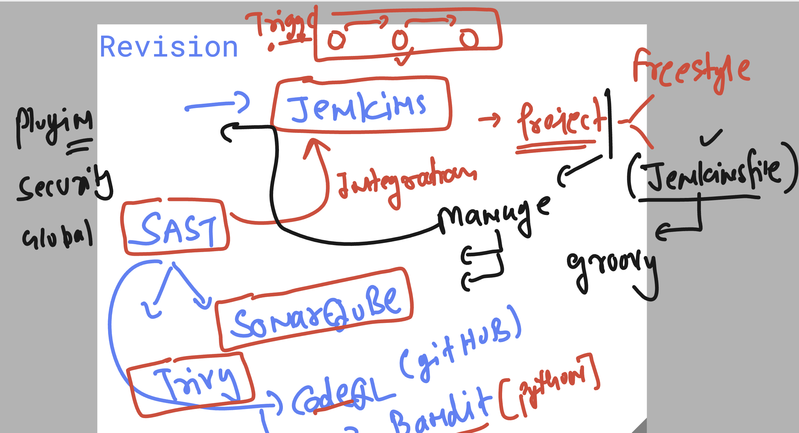
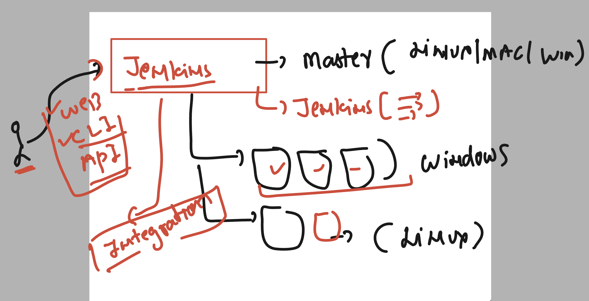
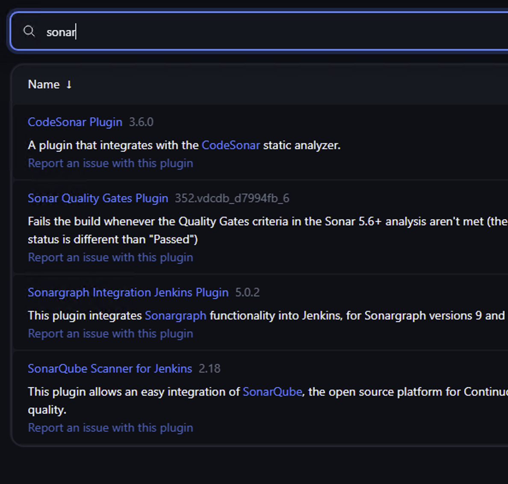
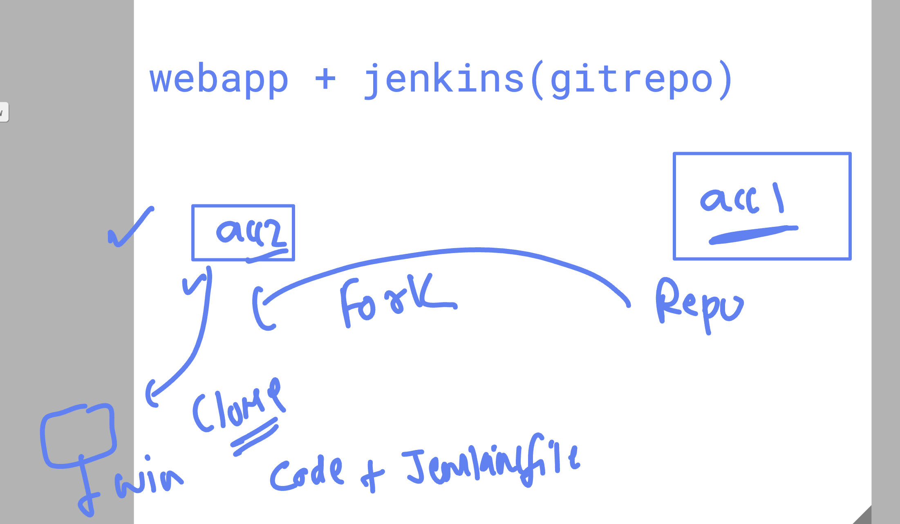
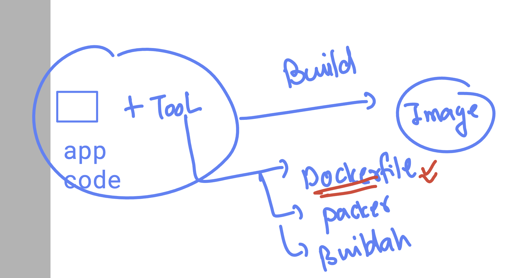
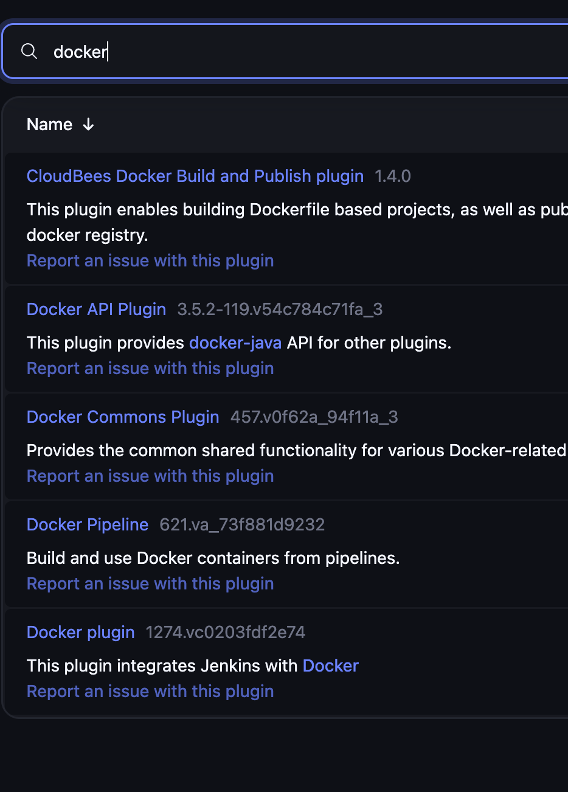
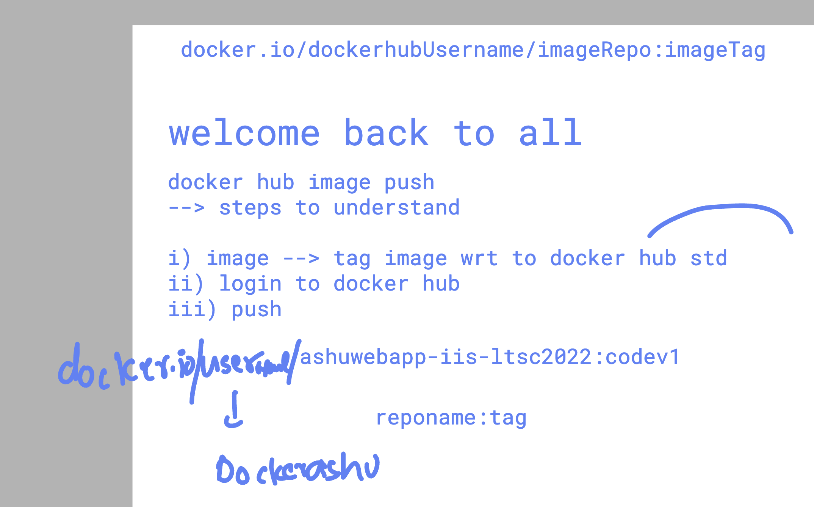

# unisys_devsecops28thjuly2025

###  jenkins review 



### jenkins cluster info 



### verify things to proceed further 

```
PS C:\Users\Administrator> docker  -v
Docker version 28.3.2, build 578ccf6
PS C:\Users\Administrator> trivy.exe version
Version: 0.64.1
Vulnerability DB:
  Version: 2
  UpdatedAt: 2025-07-29 00:36:04.19980795 +0000 UTC
  NextUpdate: 2025-07-30 00:36:04.199807679 +0000 UTC
  DownloadedAt: 2025-07-29 06:22:29.6157703 +0000 UTC
Check Bundle:
  Digest: sha256:a471e90b7c7335e914ec9075b74cf8f65e4c91e6cecfa7e39c587382808d2684
  DownloadedAt: 2025-07-29 06:40:04.6538174 +0000 UTC
PS C:\Users\Administrator> sonar-scanner.bat   version
04:33:32.639 ERROR Unrecognized option: version

usage: sonar-scanner [options]

Options:
 -D,--define <arg>     Define property
 -h,--help             Display help information
 -v,--version          Display version information
 -X,--debug            Produce execution debug output
PS C:\Users\Administrator> sonar-scanner.bat   -v
04:33:43.463 INFO  Scanner configuration file: C:\Users\Administrator\Documents\tools\sonar-scanner\bin\..\conf\sonar-scanner.properties
04:33:43.495 INFO  Project root configuration file: NONE
04:33:43.511 INFO  SonarScanner CLI 7.1.0.4889
04:33:43.511 INFO  Java 17.0.13 Eclipse Adoptium (64-bit)
04:33:43.511 INFO  Windows Server 2022 10.0 amd64
PS C:\Users\Administrator> NETSTAT.EXE -ano  | findstr.exe  80
  TCP    0.0.0.0:80             0.0.0.0:0              LISTENING       4
  TCP    0.0.0.0:8080           0.0.0.0:0              LISTENING       4772
  TCP    0.0.0.0:8082           0.0.0.0:0              LISTENING       4
  TCP    172.31.44.127:80       34.53.83.121:45432     SYN_RECEIVED    4
  TCP    172.31.44.127:8080     3.110.105.115:50000    TIME_WAIT       0
  TCP    172.31.44.127:8080     3.110.105.115:50001    TIME_WAIT       0
  TCP    172.31.44.127:8080     3.110.105.115:50002    TIME_WAIT       0
  TCP    172.31.44.127:8080     3.110.105.115:50003    TIME_WAIT       0
  TCP    172.31.44.127:8080     3.110.105.115:50004    TIME_WAIT       0
  TCP    172.31.44.127:8080     3.110.105.115:50005    TIME_WAIT       0
  TCP    172.31.44.127:62749    169.254.169.254:80     TIME_WAIT       0
  TCP    [::]:80                [::]:0                 LISTENING       4
  TCP    [::]:8080              [::]:0                 LISTENING       4772
  TCP    [::]:8082              [::]:0                 LISTENING       4
PS C:\Users\Administrator> java --version
java 21.0.8 2025-07-15 LTS
Java(TM) SE Runtime Environment (build 21.0.8+12-LTS-250)
Java HotSpot(TM) 64-Bit Server VM (build 21.0.8+12-LTS-250, mixed mode, sharing)
PS C:\Users\Administrator>

```

## pluging to install for sonarqube integration in jenkins 



### jenkinsfine -- sample 

```
pipeline {
    agent any

    stages {
        // stage1
        stage('Hello') {
            steps {
                echo 'Hello World'
            }
        }
     // stage to verify sonar-scanner 
     stage('sonar-scaner verify'){
         steps {
             echo 'checking version'
             // bat or pwsh
             bat """
             sonar-scanner --version
             """
           
         }
     }
    }
}

```

### forking repo and cloning concept 




```
sonar-scanner \
  -Dsonar.projectKey=ashu-day3 \
  -Dsonar.sources=. \
  -Dsonar.host.url=http://13.203.151.240:9000 \
  -Dsonar.token=sqp_e6efeb3a4f3b6f737ce084ad2c200fa297d54850
```

### after SAST building app into container images then deploy it 


### container image build process understanding 



### jenkins docker plugin integration 



### container image pushing to docker hub 



### windows CLI to push image 

```
PS C:\Users\Administrator\Desktop\sample-web-project> docker  images
REPOSITORY                                 TAG                          IMAGE ID       CREATED          SIZE
ashuwebapp-iis-ltsc2022                    codev1                       f7d4990f0283   58 minutes ago   5.31GB
demo-iss                                   v2                           f007f5ab84c9   8 hours ago      5.32GB
<none>                                     <none>                       b91edd248f7f   8 hours ago      5.32GB
dockerashu/ashusec                         version12                    80aaa54d43b5   8 hours ago      5.31GB
demo-iss                                   v1                           80aaa54d43b5   8 hours ago      5.31GB
demo-iis                                   latest                       c1effb468168   2 days ago       5.31GB
mcr.microsoft.com/windows/servercore/iis   windowsservercore-ltsc2022   f6240db7edca   2 weeks ago      5.31GB
hello-world                                latest                       4d9ea60132a7   2 weeks ago      297MB
mcr.microsoft.com/windows/servercore       ltsc2022                     b55ae001c969   3 weeks ago      5.2GB
mcr.microsoft.com/windows/nanoserver       ltsc2022                     6f9ae1c9bb59   3 weeks ago      297MB
PS C:\Users\Administrator\Desktop\sample-web-project> 
PS C:\Users\Administrator\Desktop\sample-web-project> 
PS C:\Users\Administrator\Desktop\sample-web-project> docker  tag    hello-world:latest   docker.io/dockerashu/hello-world:ashuimgv1 
PS C:\Users\Administrator\Desktop\sample-web-project> docker  login -u dockerashu

i Info → A Personal Access Token (PAT) can be used instead.
         To create a PAT, visit https://app.docker.com/settings


Password: 

WARNING! Your credentials are stored unencrypted in 'C:\Users\Administrator\.docker\config.json'.
Configure a credential helper to remove this warning. See
https://docs.docker.com/go/credential-store/

Login Succeeded
PS C:\Users\Administrator\Desktop\sample-web-project> docker push  docker.io/dockerashu/hello-world:ashuimgv1
The push refers to repository [docker.io/dockerashu/hello-world]
f006fbde3288: Mounted from library/hello-world
4e07a0a38d10: Mounted from library/hello-world
f7a64c5802ee: Mounted from library/hello-world

```
