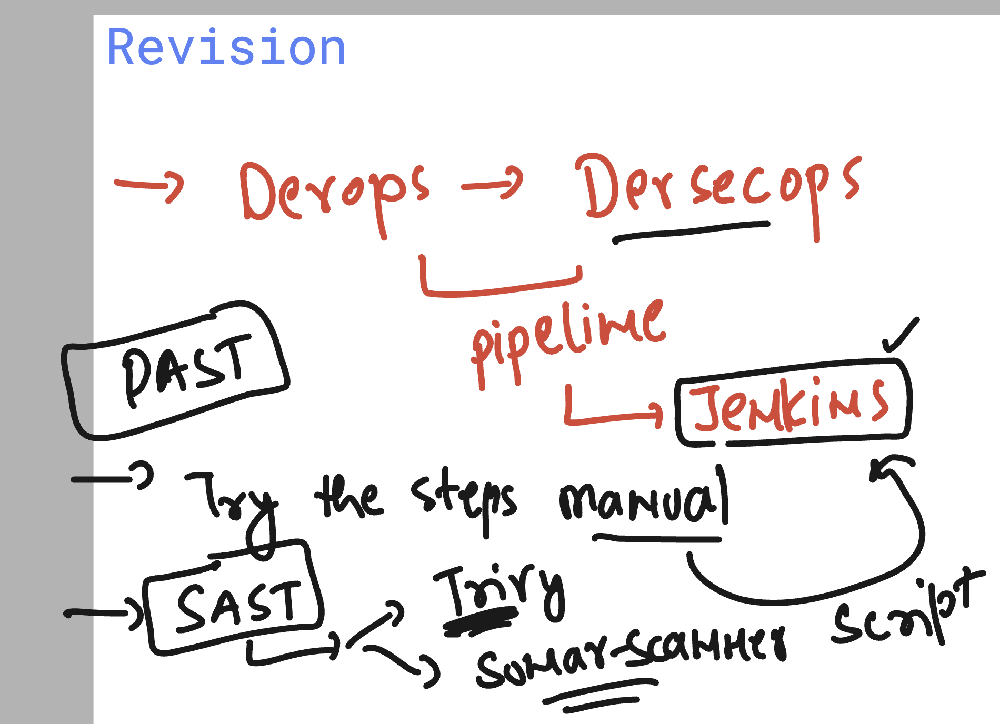
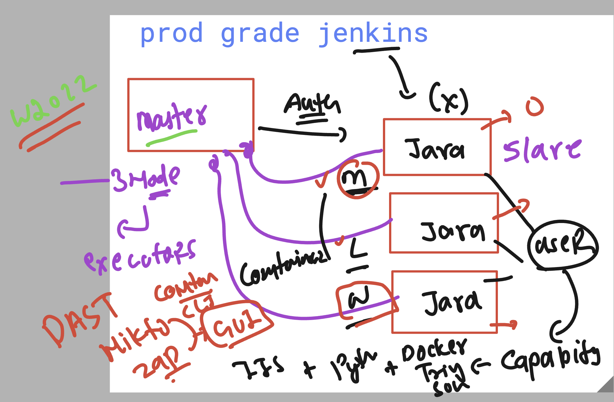
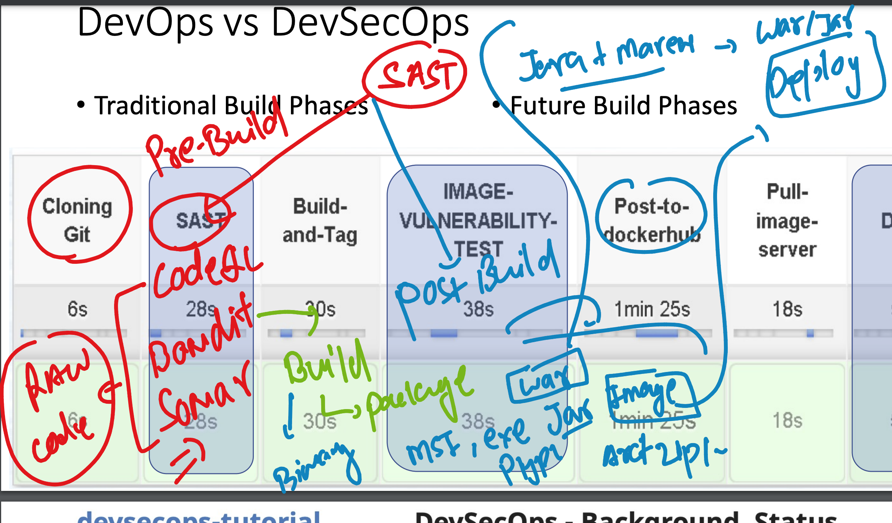
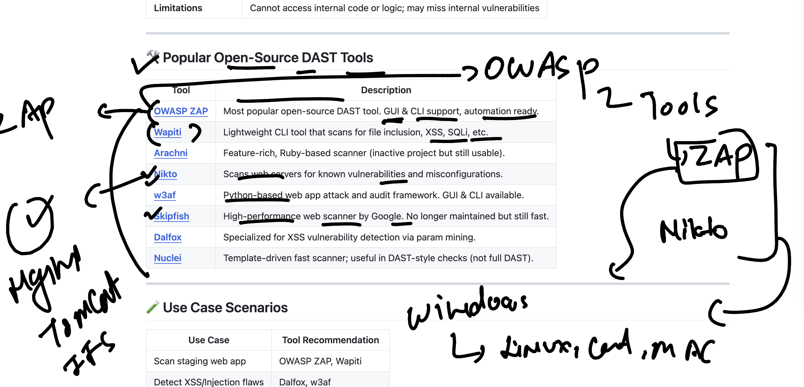

# unisys_devsecops28thjuly2025

### Revision jenkins to devsecops 



### jenkins as cluster 



### SAST in pre and post build 



## history to complet 

```
 5 docker  images
   6 trivy  image registry.hub.docker.com/dockerashu/ashuwebapp-iis-ltsc2022:codev1
   7 trivy  image  --scanners vuln --severity HIGH,CRITICAL   registry.hub.docker.com/dockerashu/ashuwebapp-iis-ltsc2022:codev1
   8 trivy  image   registry.hub.docker.com/dockerashu/ashuwebapp-iis-ltsc2022:codev1
   9 docker  images
  10 docker  save  -o  myiisapp.tar  334a5bb7eec8
  11 rm  .\helllo.tar
  12 rm   myiisapp.tar
  13 docker  ps -a
  14 docker rm $(docker ps -aq) -f
  15 docker  images
  16 docker  rmi  b55ae001c969
  17 docker  images
  18 docker  rmi  80aaa54d43b5 b91edd248f7f f007f5ab84c9 8c1a3980b159 b8c02a2f72cf
  19 docker images
  20 docker save -o iis.tar  334a5bb7eec8

```

### DAST understanding 



