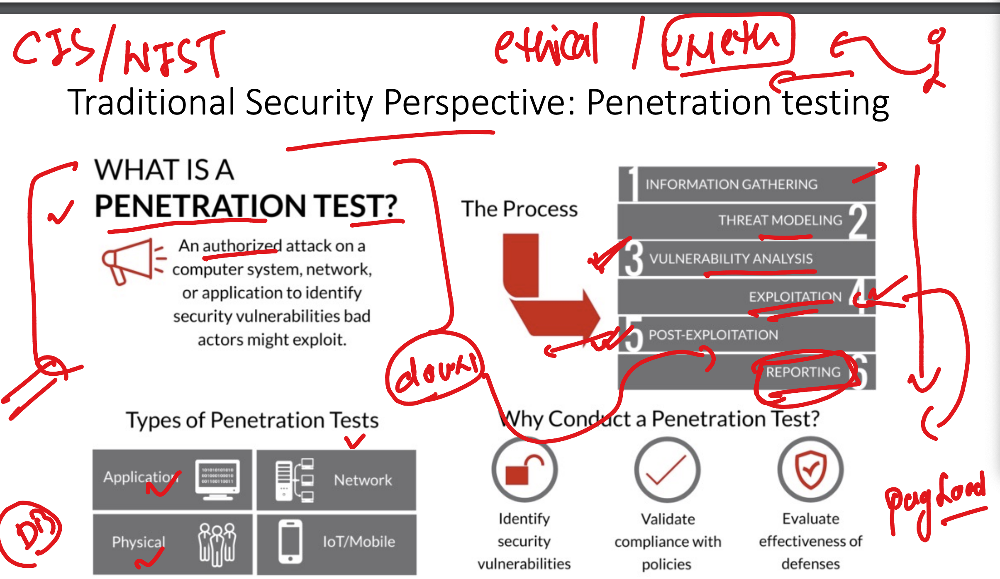
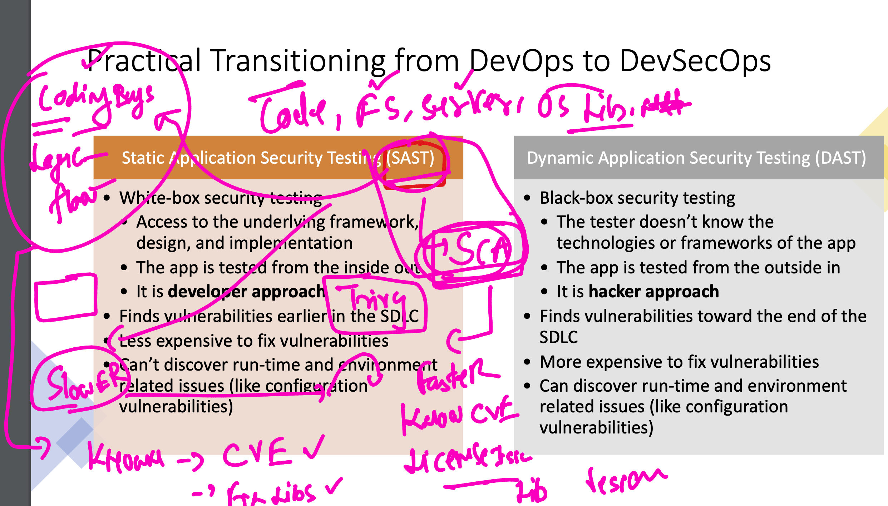
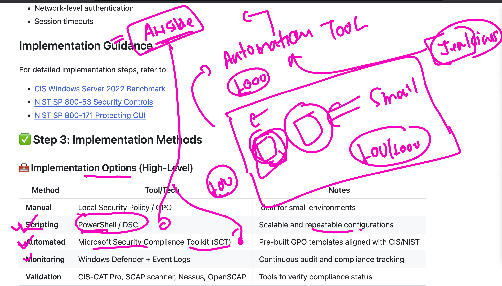
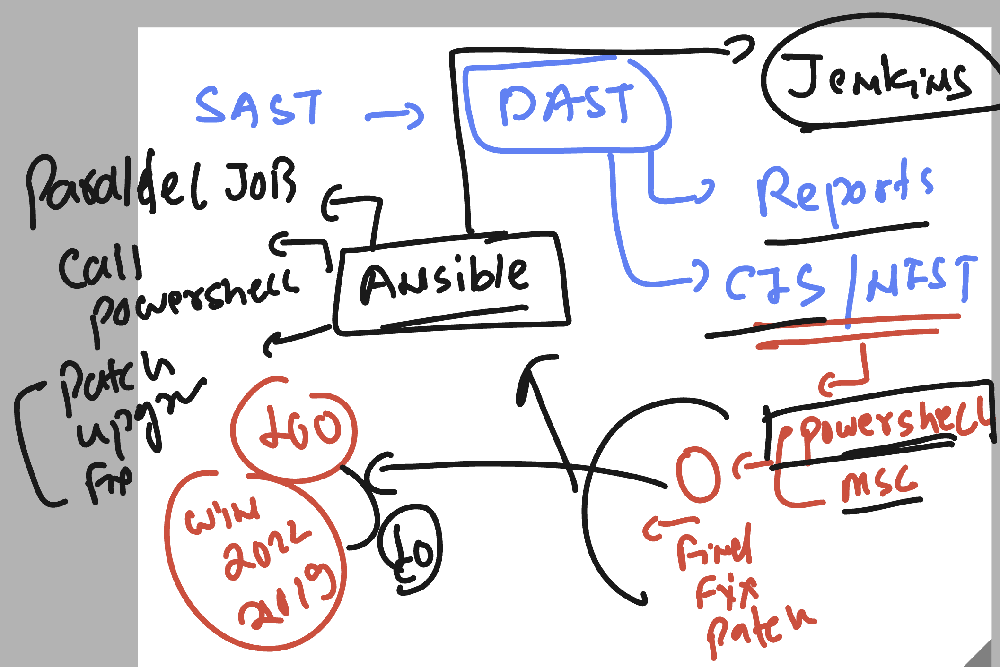
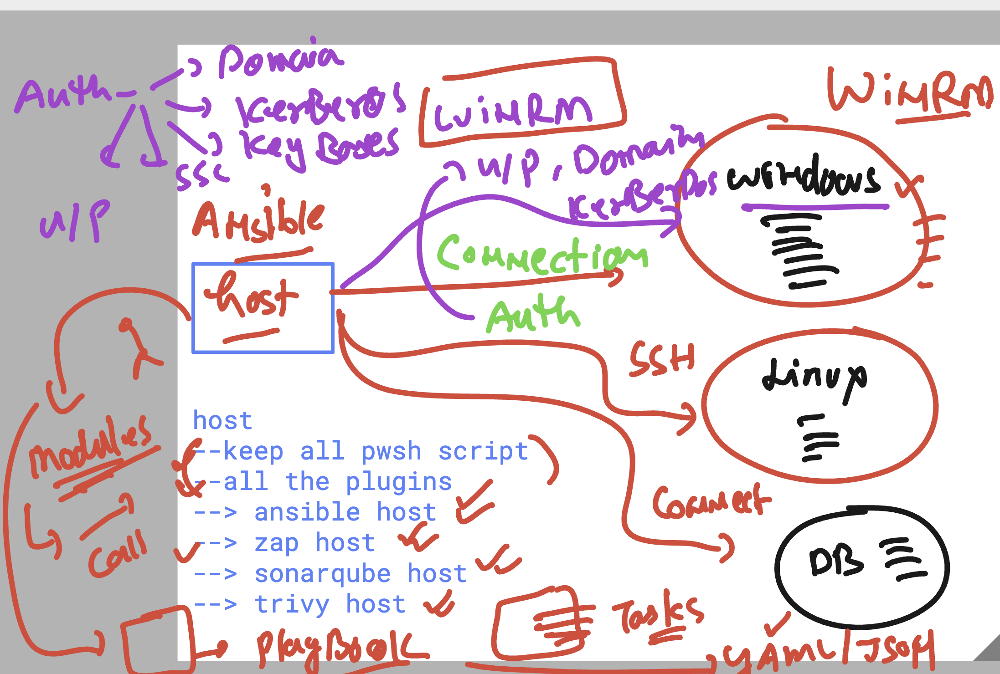
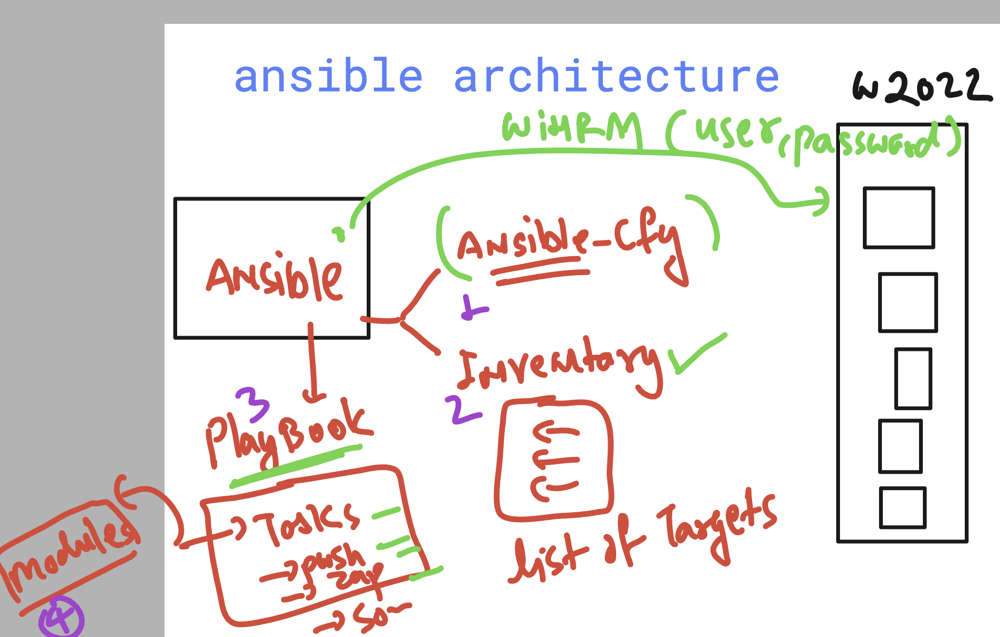

# unisys_devsecops28thjuly2025

### Understanding POST DAST -- pentesting process 



### SAST & SCA 



### zap report 

```
 114  mkdir hello 
  115  cd hello/
  116  docker run -it --rm -v $(pwd):/zap/wrk:rw ghcr.io/zaproxy/zaproxy zap-full-scan.py  -t http://172.31.44.127  -g gen.conf -r testport.html
  117   
  118  docker run -it --rm -v $(pwd):/zap/wrk:rw ghcr.io/zaproxy/zaproxy zap-full-scan.py  -t https://app.delvex.io   -g gen.conf -r ashu-port.html
  119  ls
  120  sudo cp -v ashu-port.html  /var/www/html/
```

### SEc benchmarks like CIS / NIST 



### ansible for patch / fixing management 



### ansible understanding 



### ansible architecture understanding 



### verification of ansible host 

```
### checking python version 

[ashu@ip-172-31-38-15 ~]$ python3 -V
Python 3.9.23
[ashu@ip-172-31-38-15 ~]$ 


### checking ansible version 

[ashu@ip-172-31-38-15 ~]$ ansible --version 
ansible [core 2.15.3]
  config file = None
  configured module search path = ['/home/ashu/.ansible/plugins/modules', '/usr/share/ansible/plugins/modules']
  ansible python module location = /usr/lib/python3.9/site-packages/ansible
  ansible collection location = /home/ashu/.ansible/collections:/usr/share/ansible/collections
  executable location = /usr/bin/ansible
  python version = 3.9.23 (main, Jun 27 2025, 00:00:00) [GCC 11.5.0 20240719 (Red Hat 11.5.0-5)] (/usr/bin/python3.9)
  jinja version = 3.1.4
  libyaml = True

```

### creating some directory structure to use ansible 

```
[ashu@ip-172-31-38-15 ~]$ mkdir  ansible 
[ashu@ip-172-31-38-15 ~]$ ls
ansible  ashu-reports  caches  remoting  remoting.jar  workspace
[ashu@ip-172-31-38-15 ~]$ cd  ansible/
[ashu@ip-172-31-38-15 ansible]$ ls
[ashu@ip-172-31-38-15 ansible]$ 
[ashu@ip-172-31-38-15 ansible]$ touch   ansible.cfg   inventory 
[ashu@ip-172-31-38-15 ansible]$ ls
ansible.cfg  inventory
[ashu@ip-172-31-38-15 ansible]$ 


 cp /tmp/ansible.cfg  ansible.cfg 
 cp /tmp/inventory   inventory 
```

## enable windows authentication enable for winrm 

```
winrm quickconfig -transport:http
Set-NetFirewallRule -Name "WINRM-HTTP-In-TCP" -Enabled True
winrm set winrm/config/service/auth '@{Basic="true"}'
winrm quickconfig -force
winrm set winrm/config/service @{AllowUnencrypted="true"}
Restart-Service winrm
winrm enumerate winrm/config/listener
```